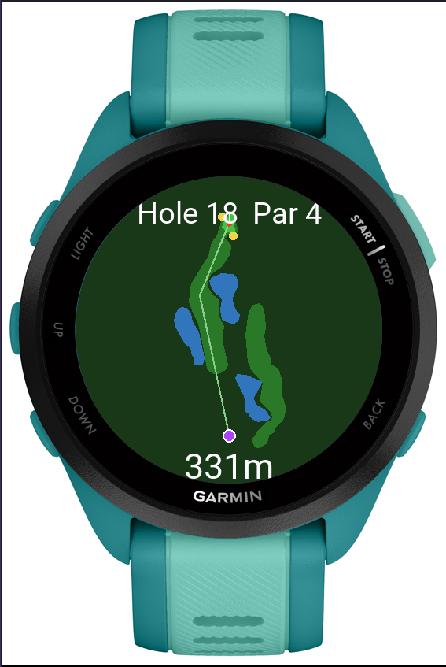
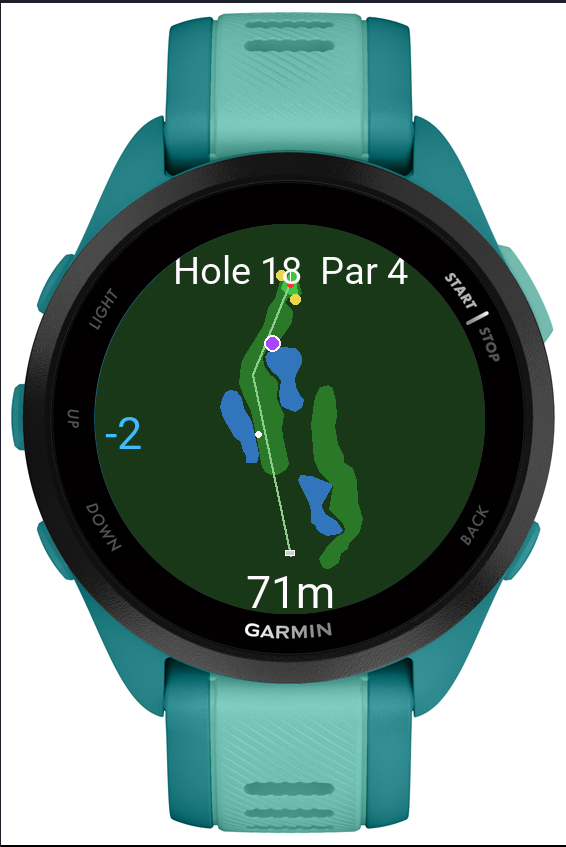
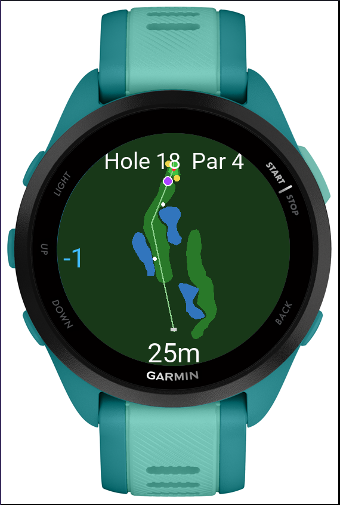
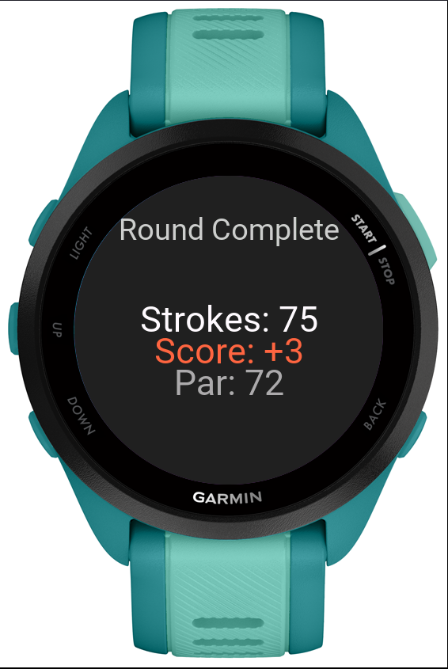
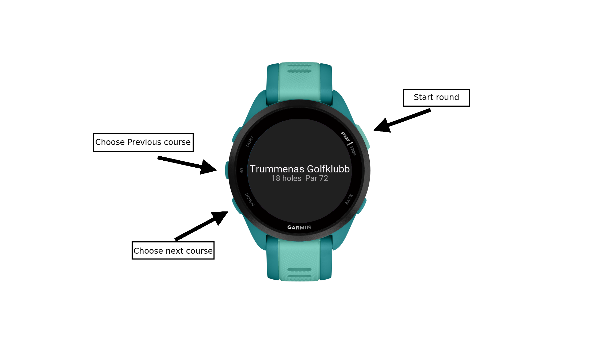
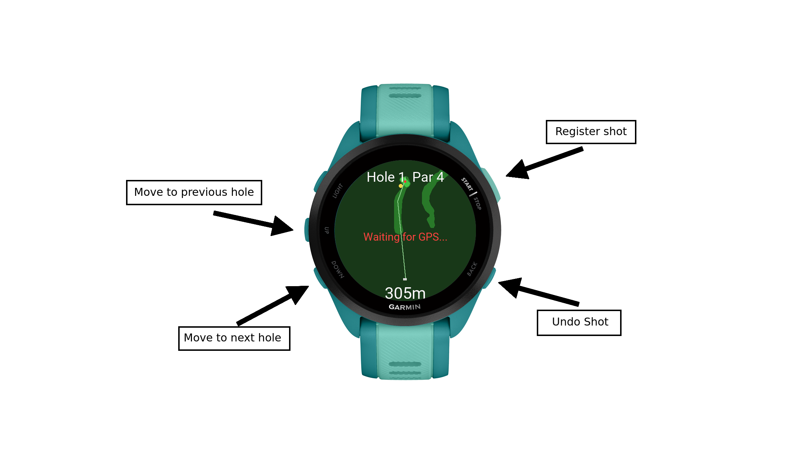
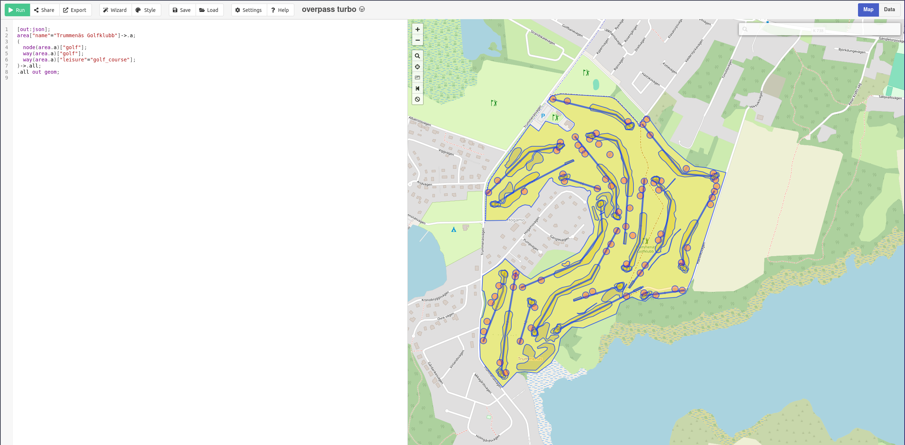

# Poor Man's Golf

This is a hobby project designed for Garmin Forerunner 165 that turns your watch into a golf GPS. It displays hole maps with fairways, greens, bunkers and water hazards, tracks your strokes, marks ball positions on the map with GPS, shows live distance to pin and records the round as a Garmin activity.

<table>
  <tr>
    <td align="center"><br><em>Tee shot</em></td>
    <td align="center"><br><em>Two shots in</em></td>
    <td align="center"><br><em>Three shots in</em></td>
    <td align="center"><br><em>Round Summary</em></td>
  </tr>
</table>

## Features

* **Course Map**: Displays each hole with fairways, greens, bunkers, water hazards, tee boxes and pins. The map is rotated so the tee is always at the bottom and the pin is always at the top.
* **Stroke Counter**: Tracks score relative to par per hole.
* **Ball Markers**: Each stroke saves your GPS position and displays it as a white dot on the map showing where each shot landed.
* **Distance to Pin**: Shows pre-defined tee-to-pin distance before your first shot, switches to live GPS-to-pin distance after.
* **Player Position**: Purple dot shows your live position on the map.
* **Activity Recording**: Records the round as a Golf activity in Garmin Connect with calories, heart rate and time.
* **Shot Data Export**: All shot positions and scores are stored in the FIT activity file and can be extracted with the included Python script.
* **Multiple Courses**: Browse and select from multiple courses on the watch.
* **Summary Page**: Shows total strokes, score to par and course par after the last hole.

## Usage

### Course Selection

1. When the app starts, the course selection screen is shown with the course name, number of holes and par.
2. Swipe up or down or use buttons to browse available courses.
3. Press the start button to begin the round.


### During Play

1. Press the **start button** to register a stroke. The watch vibrates to confirm.
2. Press the **back button** to undo the last stroke (confirmation dialog).
3. Swipe **down** or use **down button** to move to the next hole.
4. Swipe **up** or use **up button** to go back to a previous hole.



### After the Last Hole

1. After swiping past hole 18, the summary page is shown.
2. Press the **start button** to finish the round (confirmation dialog).
3. Press **up** to go back to the last hole if you need to make changes.

## Adding a New Course

### 1. Find Compatible Courses

Go to [Overpass Turbo](https://overpass-turbo.eu/), pan to your area of interest and run this query to find golf courses that are fully mapped:

```
[out:json][timeout:60];
way["leisure"="golf_course"]({{bbox}})->.courses;
foreach .courses -> .c (
  way["golf"="hole"](area.c)->.holes;
  if (holes.count(ways) >= 9)
  {
    .c out center;
  }
);
```

This only shows courses with at least 9 holes mapped. Change `>= 9` to `>= 18` for full 18-hole courses only.

### 2. Export the Course Data

Once you have found a course, run this query with the course name:

```
[out:json];
area["name"="Your Golf Club Name"]->.a;
(
  node(area.a)["golf"];
  way(area.a)["golf"];
  way(area.a)["leisure"="golf_course"];
)->.all;
.all out geom;
```

**Important:** The query must end with `out geom;` to include coordinates. Export the result as JSON.

  <br><em>Example of Overpass Turbo</em>
    
### 3. Convert with the Python Script

```bash
python osm_to_connectiq.py exported_file.json
```

The script will parse all holes, match features to the correct holes, simplify polygons, convert coordinates to integers and output a course JSON file.

#### Output Format:

```json
{
  "name": "Course Name",
  "center": [lat, lon],
  "par": 72,
  "holes": [
    {
      "num": 1,
      "par": 4,
      "hcp": 10,
      "dist": 305,
      "tee": [lat, lon],
      "pin": [lat, lon],
      "path": [[lat, lon], ...],
      "green": [[lat, lon], ...],
      "fairways": [[[lat, lon], ...], ...],
      "bunkers": [[lat, lon], ...],
      "water": [[[lat, lon], ...], ...]
    }
  ]
}
```
### 4. Register the Course in the App
Open `resources/jsonData/` and add the JSON file

Open `resources/jsonData/jsonData.xml` and add a new entry:

```xml
<jsonData id="course_your_new_course" filename="course_your_new_course.json" />
```

Then open `source/CoursePickerView.mc` and add the new resource ID to the `_loadMetadata()` function:

```
Rez.JsonData.course_your_new_course
```

### 5. Build and Deploy

Build the project and copy the `.prg` file to your watch.

## Extracting Round Data

After a round, connect the watch via USB and find the `.fit` file in `GARMIN/Activity/`. Then run:

```bash
pip install fitparse
python extract_round.py "path/to/activity.fit"
```

This outputs a JSON file with per-hole scores, all shot GPS positions with timestamps and your full walking track.

## Supported Devices

* Forerunner 165 Music
* Forerunner 165

## Project Structure

* `PoorMansGolfApp.mc` — App entry point, launches course picker
* `CourseData.mc` — Course data model loaded from JSON
* `CoursePickerView.mc` — Course selection screen
* `CoursePickerDelegate.mc` — Course picker input handling
* `GolfModel.mc` — Shared game state: scores, GPS, shots, activity recording
* `GolfDelegate.mc` — Game input handling for all views
* `HoleView.mc` — Main map page
* `HoleRenderer.mc` — Draws the hole map with all features
* `SummaryView.mc` — End of round summary screen
* `osm_to_connectiq.py` — Converts OSM data to course JSON
* `extract_round.py` — Extracts round data from FIT files

## Feedback

If you have any suggestions, questions or find a bug, feel free to open an issue.
